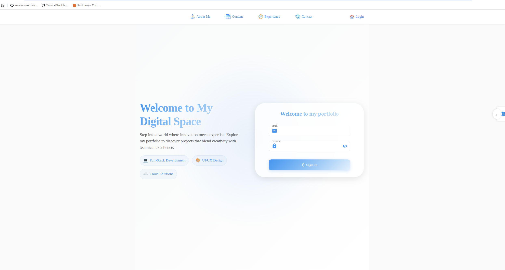
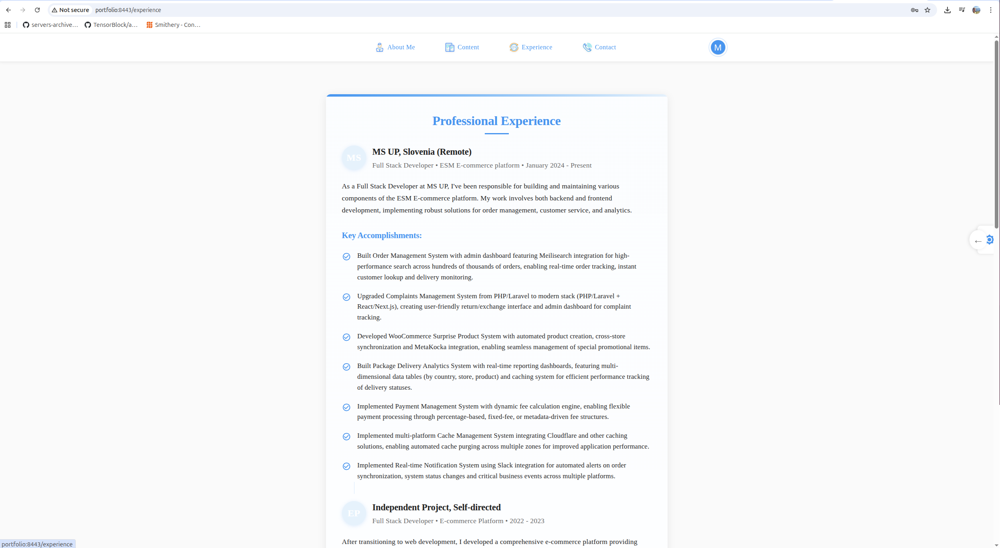
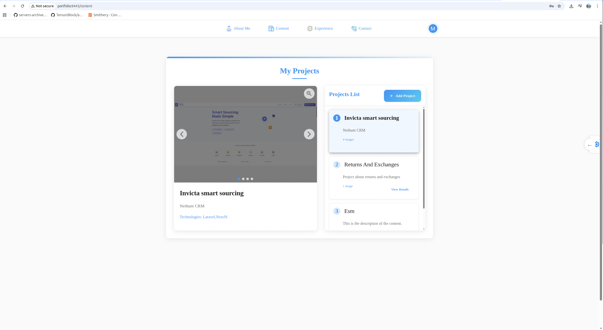
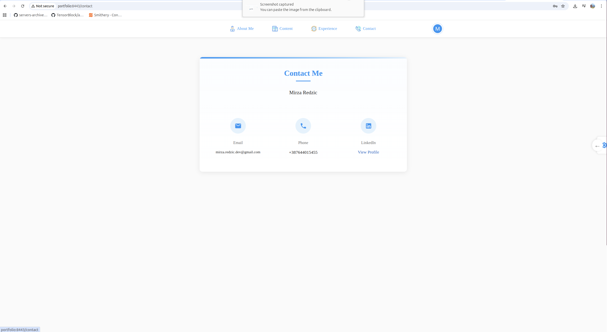

# Portfolio Monorepo

A modern, full-stack portfolio application built with Laravel and Next.js, featuring a content management system, authentication, and responsive design.

## 🎯 Overview

This is a monorepo containing a complete portfolio website with an admin panel for content management. The project demonstrates modern web development practices including RESTful API design, JWT authentication, Docker containerization, and a responsive React-based frontend.

### Key Features

- **Portfolio Showcase**: Display projects with images, descriptions, and details
- **Content Management**: Admin panel for creating, editing, and managing portfolio content
- **Authentication**: Secure login system using Laravel Sanctum (token-based)
- **Responsive Design**: Mobile-first approach with Material-UI components
- **Dark/Light Theme**: Theme switching functionality
- **Image Management**: Image carousel and viewer for project galleries
- **Experience Section**: Skills showcase and professional experience timeline
- **Contact Form**: User contact functionality

## 🛠️ Tech Stack

### Backend
- **Laravel** (PHP 8.3) - RESTful API
- **MySQL** 8.0 - Database
- **Laravel Sanctum** - API authentication
- **Docker** - Containerization

### Frontend
- **Next.js 14** (App Router) - React framework
- **React 18** - UI library
- **TypeScript** - Type safety
- **Material-UI (MUI)** - Component library
- **TailwindCSS** - Utility-first CSS
- **React Query (TanStack Query)** - Data fetching and caching
- **Axios** - HTTP client

### Infrastructure
- **Docker Compose** - Development and production environments
- **Nginx** - Reverse proxy and web server
- **Let's Encrypt** - SSL certificates (production)

## 📸 Screenshots

| Home | Projects |
|---|---|
|  |  |

| Experience | Contact |
|---|---|
|  |  |

## 📁 Project Structure

```
portfolio-monorepo/
├── portfolio-laravel/          # Laravel backend API
│   ├── app/
│   │   ├── Http/
│   │   │   ├── Controllers/    # API controllers
│   │   │   └── Requests/       # Form validation
│   │   └── Models/             # Eloquent models
│   ├── routes/
│   │   └── api.php             # API routes
│   └── database/
│       └── migrations/        # Database migrations
│
├── portfolio-next/             # Next.js frontend
│   ├── src/
│   │   ├── app/                # Next.js app router pages
│   │   ├── components/         # Reusable components
│   │   ├── sections/           # Page sections/views
│   │   ├── hooks/              # Custom React hooks
│   │   ├── services/           # API service functions
│   │   └── context/            # React context providers
│   └── public/                 # Static assets
│
├── Docker/                     # Docker configurations
│   ├── nginx/                  # Nginx configs (dev & prod)
│   ├── php8.3/                 # PHP Dockerfile
│   └── mysql/                  # MySQL config
│
├── screenshots/                # Project screenshots
├── docker-compose.dev.yml      # Development environment
├── docker-compose.prod.yml     # Production environment
├── deploy.sh                   # Deployment script
└── DEPLOYMENT.md               # Production deployment guide
```

## 🚀 Quick Start

### Prerequisites

- Docker and Docker Compose installed
- Git installed
- (Optional) Node.js 18+ and PHP 8.3+ for local development without Docker

### Development Setup (Docker - Recommended)

1. **Clone the repository**
   ```bash
   git clone https://github.com/MIRZAREDZIC/Portfolio.git
   cd Portfolio
   ```

2. **Set up environment variables**
   ```bash
   cp portfolio-laravel/.env.example portfolio-laravel/.env
   cp portfolio-next/.env.local.example portfolio-next/.env.local
   ```

3. **Generate Laravel app key**
   ```bash
   docker-compose -f docker-compose.dev.yml exec php php artisan key:generate
   ```

4. **Start development environment**
   ```bash
   docker-compose -f docker-compose.dev.yml up --build
   ```

5. **Run database migrations**
   ```bash
   docker-compose -f docker-compose.dev.yml exec php php artisan migrate
   ```

6. **Access the application**
   - Frontend: http://portfolio:3000
   - Backend API: http://portfolio:8443/api

### Development Setup (Without Docker)

#### Backend (Laravel)

```bash
cd portfolio-laravel
composer install
cp .env.example .env
php artisan key:generate
```

Configure database in `.env`:
```env
DB_CONNECTION=mysql
DB_HOST=127.0.0.1
DB_PORT=3306
DB_DATABASE=portfolio
DB_USERNAME=root
DB_PASSWORD=your_password
```

```bash
php artisan migrate
php artisan serve
```

#### Frontend (Next.js)

```bash
cd portfolio-next
npm install
cp .env.local.example .env.local
# Set NEXT_PUBLIC_API_URL=http://portfolio:8000/api in .env.local
npm run dev
```

Open http://localhost:3000 in your browser.

## 🔐 Authentication

The application uses **Laravel Sanctum** for API authentication:

- **Login**: `POST /api/login` with `email` and `password`
- **Token**: Returns a Bearer token stored in HTTP-only cookies
- **Protected Routes**: Include `Authorization: Bearer {token}` header
- **Logout**: `POST /api/logout` to invalidate token

> ⚠️ Create your admin user via `php artisan tinker` before first login.

## 📝 API Endpoints

### Authentication
- `POST /api/login` - User login
- `POST /api/logout` - User logout
- `GET /api/user` - Get authenticated user

### Content Management
- `GET /api/contents` - List all content items
- `POST /api/contents` - Create new content
- `GET /api/contents/{id}` - Get specific content
- `PUT /api/contents/{id}` - Update content
- `DELETE /api/contents/{id}` - Delete content

## 🔧 Environment Variables

#### Laravel (`portfolio-laravel/.env`)
```env
APP_NAME=Portfolio
APP_ENV=local
APP_KEY=base64:...
APP_DEBUG=true
APP_URL=http://portfolio

DB_CONNECTION=mysql
DB_HOST=mysql
DB_PORT=3306
DB_DATABASE=portfolio
DB_USERNAME=portfolio
DB_PASSWORD=secret
```

#### Next.js (`portfolio-next/.env.local`)
```env
NEXT_PUBLIC_API_URL=http://portfolio:8443/api
```

## 🐳 Docker Services

### Development (`docker-compose.dev.yml`)
- **nginx**: Port 8443 (reverse proxy)
- **php**: Laravel application
- **nextjs**: Next.js dev server (port 3000)
- **mysql**: MySQL 8.0 (port 3306)

### Production (`docker-compose.prod.yml`)
- **nginx**: Ports 80/443 with SSL
- **php**: Production PHP-FPM
- **nextjs**: Built Next.js application
- **mysql**: MySQL with persistent volumes
- **certbot**: SSL certificate management

## 🏗️ Production Deployment

See [DEPLOYMENT.md](./DEPLOYMENT.md) for detailed instructions.

```bash
./init-letsencrypt.sh
./deploy.sh
```

## 🎓 What This Project Demonstrates

- **Monorepo Architecture**: Managing multiple projects in a single repository
- **API Design**: RESTful API with proper authentication and validation
- **Modern Frontend**: React hooks, context API, and component composition
- **Docker Workflow**: Development and production containerization
- **Type Safety**: TypeScript integration in Next.js
- **State Management**: React Query for server state, Context for global state

## 📄 License

This project is open source and available under the [MIT License](./LICENSE).

## 👤 Author

**Mirza Redžić** — Full Stack Developer
- GitHub: [@MIRZAREDZIC](https://github.com/MIRZAREDZIC)
- Email: mirza.redzic.dev@gmail.com
- LinkedIn: [View Profile](https://www.linkedin.com/in/mirza-redzic/)

---

⭐ If you find this project helpful, please consider giving it a star!